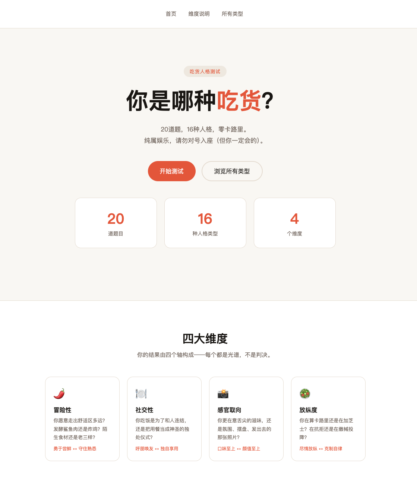

# 吃货人格测试

**你是哪种吃货？** 20道题，16种人格，零卡路里。

## 体验

🔗 [foodie-type.vercel.app](https://foodie-type.vercel.app)

## 四大维度

| 维度 | 光谱 |
|------|------|
| 🌶️ 冒险性 | 勇于尝鲜 ↔ 守住熟悉 |
| 🍽️ 社交性 | 呼朋唤友 ↔ 独自享用 |
| 📸 感官取向 | 口味至上 ↔ 颜值至上 |
| 🥗 放纵度 | 尽情放纵 ↔ 克制自律 |

## 16 种人格类型

`ASFI` `ASFH` `ASVI` `ASVH` `ALFI` `ALFH` `ALVI` `ALVH`  
`CSFI` `CSFH` `CSVI` `CSVH` `CLFI` `CLFH` `CLVI` `CLVH`

## 技术栈

纯 HTML / CSS / JS，无框架，无依赖，部署在 Vercel。
